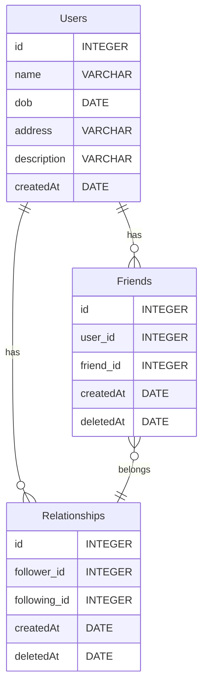

## Description

Test task INFIJOY

## Overview

API for creating users connect them with creating relations and making friends

## Installation

````bash
# Step 1: Clone the repository
git clone https://github.com/temirlanamangaliyev/infijoy-test-task

# Step 2: Install dependencies
cd infijoy-test-task
npm install

## Running the app

```bash
# development
$ npm run start

# watch mode
$ npm run start:dev

# production mode
$ npm run start:prod
````

## Testing

```bash
# unit tests
$ npm run test

# test coverage
$ npm run test:cov
```

## API Documentation

To access the API documentation, run the API and visit http://localhost:3000/api. This will open Swagger on your local machine.

## Folder structure

    src: Contains the source code of the application.

    test: Contains the unit tests for the application.

## Database schema



The Users entity has the following attributes: id, name, dob, address, description, and createdAt.

The Friends entity has the following attributes: id, user_id, friend_id, createdAt, and deletedAt.

The Relationships entity has the following attributes: id, follower_id, following_id, createdAt, and deletedAt.

The relationships are represented using arrows between the entities:

Users has a one-to-many relationship with Friends and Relationships.
Friends and Relationships have a many-to-one relationship.

## Env variables

Environment Variables
The application requires the following environment variables to be set in .file, auth is implemented with guards:

AUTH0_AUDIENCE
AUTH0_DOMAIN

Make sure to set these variables before running the application. For more comfortable testing guards is commented, if u want to check it set your own keys and API token
